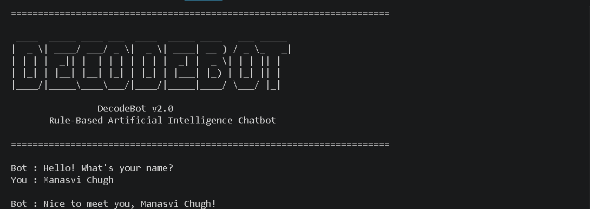

<p align="center">
  
</p>


# 🤖 DecodeBot v2.0

A modular **Rule-Based AI Chatbot** developed in Python as part of the **DecodeLabs Artificial Intelligence Industrial Training Program (Batch 2026)**.

DecodeBot demonstrates the fundamentals of Artificial Intelligence using predefined rules and logical decision-making instead of Machine Learning. The project focuses on writing clean, maintainable Python code while providing an interactive chatbot experience.

---

## Project Overview

Rule-Based AI is one of the earliest approaches to Artificial Intelligence. Instead of learning from data, the chatbot follows predefined rules to respond to user commands.

DecodeBot was built to strengthen concepts such as:

- Control Flow
- Decision Making
- Conditional Statements
- Loops
- Modular Programming
- User Interaction
- Problem Solving

The chatbot continuously accepts user input until an exit command is received.

---

## Features

### Conversation

- Greeting detection
- Personalized welcome message
- Help menu
- Conversation history
- Exit commands

### Knowledge Base

- Artificial Intelligence
- Machine Learning
- Deep Learning
- Python
- Java
- C++
- JavaScript
- HTML
- CSS

### Utilities

- Calculator
- Square
- Cube
- Factorial
- Percentage Calculator
- Multiplication Table
- Current Date
- Current Time
- System Information
- Clear Screen

### Entertainment

- Programming Jokes
- AI Facts
- Motivation Quotes
- Mini Quiz

### Project Features

- Modular architecture
- Random responses
- Chat history storage
- Clean code structure
- Beginner-friendly implementation

---

## Project Structure

```
Rule-Based-AI-Chatbot
│
├── chatbot.py
├── responses.py
├── utils.py
├── README.md
├── LICENSE
├── requirements.txt
├── .gitignore
├── screenshots/
└── chat_history.txt
```

---

## Technologies Used

- Python 3
- VS Code

No external Python packages are required.

---

## How to Run

Clone the repository

```bash
git clone https://github.com/YOUR_USERNAME/Rule-Based-AI-Chatbot.git
```

Open the project

```bash
cd Rule-Based-AI-Chatbot
```

Run the chatbot

```bash
python chatbot.py
```

---

## Sample Commands

```
hello
help
calculator
square
cube
factorial
percentage
table
joke
fact
motivate
quiz
history
system
date
time
about
exit
```

---

## Learning Outcomes

Through this project, I learned how to:

- Build a Rule-Based AI system
- Design decision-making logic
- Organize Python projects into modules
- Handle user input effectively
- Develop interactive console applications
- Improve code readability and maintainability

---

## Future Enhancements

- Natural Language Processing (NLP)
- Speech Recognition
- Voice Responses
- GUI using Tkinter
- Database Integration
- API Integration
- Machine Learning Based Responses

---

## Author

**Manasvi Chugh**

B.Tech – Computer Science Engineering (AI & ML)

Artificial Intelligence Intern

---

## License

This project is licensed under the MIT License.
